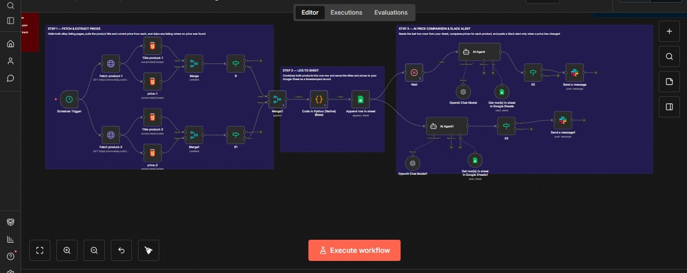

# Autonomous AI E-Commerce Price Tracker & Slack Alerter (n8n Workflow)

An enterprise-grade e-commerce intelligence pipeline built on **n8n** that monitors target retail assets, maintains historical data logging, and uses **autonomous LangChain agents** to analyze pricing trends and dispatch contextual alerts.

## 🚀 System Architecture & Logic Flow

The workflow operates asynchronously across three distinct logical stages:

1. **Ingress Extraction & Parsing:** Driven by a customizable `Schedule Trigger`, the workflow fires concurrent HTTP requests to target retail listings (e.g., eBay). It isolates structural page data via custom CSS selectors (`title` and `.x-price-primary .ux-textspans`) using native HTML parser nodes, filtering out invalid or dead listings via conditional validation blocks.
2. **Data Wrangling & Ledger Persistence (Python Layer):** Validated data streams are combined and channeled through a native **Python Code Node**. This script formats the unstructured inputs into structured objects mapped directly to a **Google Sheets tracking matrix**.
3. **Multi-Agent Trend Analysis & Notification Gateways:** After updating the sheet ledger, two independent **LangChain AI Agents** (powered by `gpt-4.1-mini`) execute concurrently. 
   * Each agent is equipped with a specific Google Sheets reading tool to dynamically fetch and analyze the final tracking rows.
   * The agents calculate delta variance, establish price change vectors (increase, decrease, or stagnant), and draft a final recommendation.
   * Downstream routing layers scan the AI agent outputs; if a structural price adjustment is flagged, a custom summary is formatted and dispatched via a webhook node directly to designated **Slack communication channels**.

---

## 🔧 Component Dependencies

To run or replicate this integration pipeline, you will require active accounts and authorization keys for the following services:

* **n8n Instance:** Self-hosted docker engine or cloud workspace environment.
* **OpenAI Developer Platform:** API access tokens supporting chat completions (`gpt-4.1-mini`).
* **Google Workspace Account:** Access to Google Sheets for chronological log persistence.
* **Slack App Credentials:** An integrated Slack application with `chat:write` bot scopes.

### Google Sheets Setup Requirement
Before activating the workflow, create a Google Sheet containing a sheet named `Sheet1` with the following column headers in row 1:
* `Product_1`
* `Price_1`
* `Product_2`
* `Price_2`

---

## 💻 Installation & Deployment

1. Create a blank workflow canvas inside your n8n configuration dashboard.
2. Select **Import from File** from the top right context menu and upload the `workflow/ECOM Price Tracking.json` file.
3. Configure target URLs inside the `Fetch-product-1` and `Fetch product-2` HTTP request nodes.
4. Link your Google account to the spreadsheet nodes (`Append row in sheet`, `Get row(s) in sheet`).
5. Connect your OpenAI secret token to both `OpenAI Chat Model` blocks.
6. Authorize the Slack API nodes and point them to your target alert channel (e.g., `#price-test`).
7. Toggle the workflow to **Active**.
